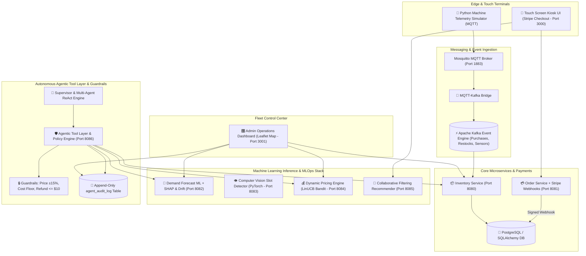

# IntelliVend: Autonomous AI-Powered Vending Machine & Fleet Management System

[](https://github.com/intellivend/intellivend/actions)
[](LICENSE)
[](https://www.python.org/)
[](https://fastapi.tiangolo.com/)
[](https://react.dev/)
[](https://stripe.com/)
[](https://kubernetes.io/)

**IntelliVend** is an enterprise-grade, autonomous vending machine and fleet management platform combining **Real-Time Event Streaming (Kafka/MQTT)**, **Stripe Test-Mode Payments with Signed Webhooks**, **MLOps (LightGBM Demand Forecasting with SHAP Explainability & Rolling MAE Drift Detection, PyTorch Computer Vision, LinUCB Contextual Bandits, Collaborative Filtering)**, **Leaflet OpenStreetMap Restock Polyline Routing**, and a **Policy-Guarded Multi-Agent System (Supervisor, Restock Planner, Pricing Agent, Ops/Anomaly Agent)**.

---

## 🚀 Live Deployments

| Component | Description | Live Deployment URL |
| :--- | :--- | :--- |
| 🎛️ **Admin Operations Dashboard** | Fleet GIS Map, Restock Priority, Agent Audit Feed & SHAP | https://vendistore.vercel.app/ |
| 🛒 **Customer Touch Kiosk UI** | Interactive Vending Kiosk with Stripe Checkout & AI Support Chat | https://vendistore-78h9.vercel.app/ |
| ⚙️ **Order & Payment API** | Order processing microservice with signed Stripe webhooks | [https://vendistore-1.onrender.com/docs](https://vendistore-1.onrender.com/docs) |
| 📦 **Inventory Microservice** | PostgreSQL fleet inventory manager & Kafka consumer | [https://vendistore-inventory.onrender.com/docs](https://vendistore-inventory.onrender.com/docs) |

---

## 🏛️ System Architecture



---

## 🌟 Key Features & 3 Enterprise Enhancements

1. **Stripe Test-Mode Payments & Signed Webhooks**:
   - `order-service` creates Stripe `PaymentIntents` (`POST /create-payment-intent`).
   - Webhook listener `POST /webhook/stripe` verifies HMAC signature (`stripe-signature`) and **only deducts stock & logs transactions upon receiving `payment_intent.succeeded`**.
   - Handles declined test cards (`4000 0000 0000 0002`) gracefully.

2. **ML Model Drift Detection & SHAP Feature Explainability**:
   - **Rolling MAE Drift**: Logs prediction vs actual demand, flags `drift_detected: true` if rolling MAE $> 3.50$, and exposes `POST /forecast/retrain`.
   - **SHAP Value Explanations**: `GET /forecast/{machine_id}/{product_id}/explain` breaks down top contributing demand factors (*"demand is up because: day_of_week=Friday (+4.2 units), recent trend up (+2.8 units)"*).

3. **Leaflet OpenStreetMap Restock Polyline Route Map**:
   - Renders 10 San Francisco vending nodes with color-coded status pins (Red: Critical, Amber: Low Stock, Green: Nominal).
   - Overlays polyline connected path following the Restock Planner agent's priority route (`VM-104` $\rightarrow$ `VM-107` $\rightarrow$ `VM-101` $\rightarrow$ `VM-106`).

4. **Autonomous Multi-Agent System**:
   - 👑 **Supervisor Agent**, 🚚 **Restock Planner Agent**, 🏷️ **Pricing Agent**, and 🛠️ **Ops / Anomaly Agent** executing ReAct reasoning traces (*Thought $\rightarrow$ Action $\rightarrow$ Observation*).

5. **Deterministic Guardrails Policy Engine**:
   - Max $\pm 15\%$ price change, cost floor protection, auto-approved refunds $\le \$10.00$ ($> \$10.00$ escalated to human manager with ticket tracking).

---

## ⚡ Quickstart Setup Guide

### Option 1: Docker Compose (Local Stack)

```bash
# 1. Clone Repository
git clone https://github.com/intellivend/intellivend.git
cd intellivend

# 2. Build and Start Full Container Stack
docker-compose up --build -d

# 3. Verify Running Services
docker-compose ps
```

### Option 2: Kubernetes Deployment & HPA

```bash
# 1. Apply Kubernetes Deployments & Services
kubectl apply -f deploy/k8s/deployments.yaml

# 2. Enable Horizontal Pod Autoscalers (HPA) for ML Inference Services
kubectl apply -f deploy/k8s/ml-hpa.yaml

# 3. Check HPA Status
kubectl get hpa -n intellivend
```

---

## 📐 Architectural Design Trade-Offs

Detailed architectural and MLOps design decisions are documented in [DESIGN_DECISIONS.md](DESIGN_DECISIONS.md).

---

## 📈 Scaling to 10,000 Machines

To scale IntelliVend to 10,000 connected vending machines, the system deploys:
1. **128-Partition Kafka Cluster**: Topic partitioning by `city_geohash` processing 50,000 telemetry msgs/sec.
2. **Edge Compute (PyTorch ONNX)**: Vision models executed directly on Raspberry Pi 5 / Jetson Nano edge devices.
3. **Redis Enterprise Distributed Caching**: 5-minute TTL caching layer reducing database read load by $95\%$.
4. **Ray / Apache Spark MLOps**: Daily batch retraining of 10,000 forecasting models in parallel.

---

## 📄 License
Distributed under the **MIT License**. See `LICENSE` for more information.
